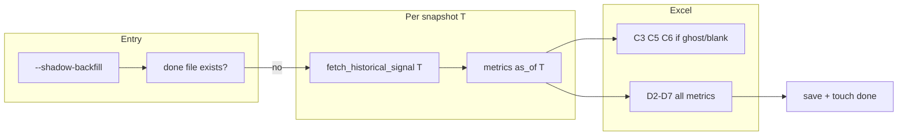

# SNOW Retro-Analysis Backfill Plan

## Canonical cockpit maps (source of truth)

**Physics_Engine** weekly trend rows are **phys_row 2–7** in `ROW_MAP` — the same rows `shift_physics_trends()` uses in [emea_gov_refresh.py](emea_gov_refresh.py) (columns **B–E** = Wk1–Wk4). [CURSOR_HANDOVER_emea_gov_refresh.md](CURSOR_HANDOVER_emea_gov_refresh.md) listing rows 44–49 for Block 4 is **documentation drift**; align the handover to the code when touching docs, not the reverse.

**`ROW_MAP` and `read_prev_values()`** should match:

```python
ROW_MAP = {
    "incident_aging":   {"cv": "B4",  "ts": "F4",  "er": "G4",  "phys_row": 2},
    "catalogue_aging":  {"cv": "B5",  "ts": "F5",  "er": "G5",  "phys_row": 3},
    "sla_x2":           {"cv": "B6",  "ts": "F6",  "er": "G6",  "phys_row": 4},
    "no_movement":      {"cv": "B8",  "ts": "F8",  "er": "G8",  "phys_row": 5},
    "repeat_mi":        {"cv": "B10", "ts": "F10", "er": "G10", "phys_row": 6},
    "problems_no_rca":  {"cv": "B11", "ts": "F11", "er": "G11", "phys_row": 7},
}
```

```python
# read_prev_values() return dict — Operations_Panel
return {
    "incident_aging":  {"current": ws["B4"].value,  "avg_4w": ws["C4"].value},
    "catalogue_aging": {"current": ws["B5"].value,  "avg_4w": ws["C5"].value},
    "sla_x2":          {"current": ws["B6"].value,  "avg_4w": ws["C6"].value},
    "no_movement":     {"current": ws["B8"].value,  "avg_4w": ws["C8"].value},
    "repeat_mi":       {"current": ws["B10"].value, "avg_4w": ws["C10"].value},
    "problems_no_rca": {"current": ws["B11"].value, "avg_4w": ws["C11"].value},
}
```

**Metric → Physics row (for backfill and `shift_physics_trends`):**

| Metric | `phys_row` | Wk2 partial (col C) | Wk3 full (col D) |
|--------|------------|---------------------|------------------|
| `incident_aging` | 2 | — | D2 |
| `catalogue_aging` | 3 | C3 | D3 |
| `sla_x2` | 4 | — | D4 |
| `no_movement` | 5 | C5 | D5 |
| `repeat_mi` | 6 | C6 | D6 |
| `problems_no_rca` | 7 | — | D7 |

*(Original prompt “rows 45, 47, 48” and “44–49” correspond to the **Build Pack / handover** layout; **this implementation uses rows 2–7** per `ROW_MAP`.)*

## Context from the codebase

- **Metric engine** lives in [emea_gov_refresh.py](emea_gov_refresh.py): `calc_m1_incident_aging` through `calc_m6_problems_no_rca` use a global `TODAY` midnight for `age_days()` and staleness; **historical mode requires an explicit `as_of` datetime** passed into refactored helpers (or parallel `*_as_of()` wrappers).
- **Incident fetch** must stay **batch-by-site** (`location.u_site_name={site}`) per existing comments—`location.u_region=EMEA` is unreliable on `incident`. The user’s “Location.Region = EMEA” intent is satisfied by the **same EMEA site list** as today (`fetch_emea_sites()`), not a single region-only query on incidents.

## 1. Historical query: `fetch_historical_signal(target_date)`

Implement a function that returns **four datasets** shaped like today’s `fetch_*` outputs: **incidents**, **catalogue `sc_task`**, **MI history** (for repeat MI), **problems**—each filtered to **“open/active as of `target_date`”** for EMEA scope.

**Encoded-query semantics (point-in-time):**

- **Incidents (per site, same batch pattern as `fetch_incidents`):**  
  `opened_at < target_date` **AND** (`resolved_at` is empty **OR** `resolved_at > target_date`) **AND** existing `caller_id` exclude.  
  Prefer **date-based** reconstruction over `stateNOT IN 6,7,8` alone, because many tickets open on the snapshot date are **closed now**; `resolved_at`/`closed_at` relative to `target_date` is what makes the snapshot correct.
- **`sc_task`:** Use working `EMEA_LOCATION_FILTER` + **point-in-time** closure: `opened_at < target_date` **AND** (not closed before `target_date`). Include `closed_at` (and/or resolution fields your instance uses) in `sysparm_fields`; mirror the **numeric prefix strip** and `EMEA_SITES` filter used in `fetch_catalogue_tasks()`.
- **Problems (for M6):** Extend fields vs `fetch_problems()` with closure dates so Python can filter to “open as of `target_date`” + existing RCA filters.
- **MI history (for M5):** Mirror `fetch_major_incident_history()` but anchor the window to **`target_date`**: e.g. P1/P2 with `opened_at` in `[target_date - 60 days, target_date]` (batch-by-site), so `calc_m5_repeat_mi` logic can run with `opened_at` sorted relative to the snapshot.

**Timezone:** Define `target_date` as **timezone-aware** (document choice: **UTC** vs **Europe/London** for “Friday 17:00”). Use the same string format as existing SNOW queries after normalizing to the instance’s expected TZ.

## 2. Metric calculations as-of snapshot

Refactor or wrap so all durations use **`as_of`** instead of module `TODAY`:

| Metric | As-of logic |
|--------|-------------|
| **M1 Incident aging** | Age = `as_of - opened_at`; % with age ≤ 10 **days** (same threshold as `calc_m1`). |
| **M2 Catalogue aging** | Age = `as_of - opened_at`; % ≤ 30 **days** (same as `calc_m2`). |
| **M3 SLA x2** | Age in days vs `sla_target`/defaults; same breach rule as `calc_m3`. |
| **M4 No movement** | Stale if **`as_of - sys_updated_on` ≥ 14 days**, but **only consider rows with `sys_updated_on ≤ as_of`**. Document limitation: true “no updates in the 14 days **before** as_of” without **audit/history** is not fully reconstructable. |
| **M5 Repeat MI** | Run same pairing logic as `calc_m5_repeat_mi` on the **historical MI frame**. |
| **M6 Problems no RCA** | Age = `as_of - opened_at`; same 30/60 banding and blank `u_root_cause` as `calc_m6_problems_no_rca`. |

**Excel value format for Physics:** Match `update_cockpit()`: percentages stored as **decimals** when writing to Block 4 (e.g. 6.6% → `0.066`); counts as **integers**.

## 3. Target snapshots and write map

Fixed constants (or config block at top of backfill section):

- **Wk2** — `2026-03-13 17:00` (tz as chosen): write **column C** only for **`catalogue_aging`, `no_movement`, `repeat_mi`** → cells **C3, C5, C6** (per `phys_row` 3, 5, 6).
- **Wk3** — `2026-03-20 17:00`: write **column D** for **all six metrics** → **D2–D7**.

## 4. “Ghost zeros” / blank gate for Wk2 only

Before writing Wk2, **read** current `Physics_Engine` cells **C3, C5, C6** (`data_only=True`). Treat as “needs backfill” if:

- cell is `None` / empty string, **or**
- numeric **0** (and optionally `0.0` / `0%` formatted—normalize with a small helper).

If a cell **already has a non-zero value**, **skip** writing that metric for Wk2. Wk3 writes **always** fill **D2–D7** (all six).

## 5. Single-execution guard (no impact on Monday 08:00 live run)

- **`--shadow-backfill` + done-file** (e.g. `shadow_backfill.done` next to the script) so scheduled runs cannot accidentally trigger historical code.

## 6. Integration points

- Add **`argparse` flag** `--shadow-backfill`: loads sites → runs the two snapshots → writes Excel → creates done-file → exits **without** the normal weekly path.
- **Do not** call backfill from the default `main()` path.
- Reuse **`snow_query()`**, logging, and `COCKPIT_PATH`; handle `PermissionError` like `update_cockpit()`.

## 7. Risks / validation

- **Volume:** Two full snapshot passes ≈ **2×** batch-by-site API load; log progress per site as today.
- **Field parity:** Validate `resolved_at` / `closed_at` on `sc_task` and `problem` on your instance.
- **Calibration:** Confirm `Physics_Engine` rows 2–7 align with the six metric labels in the workbook (should match `ROW_MAP`).


